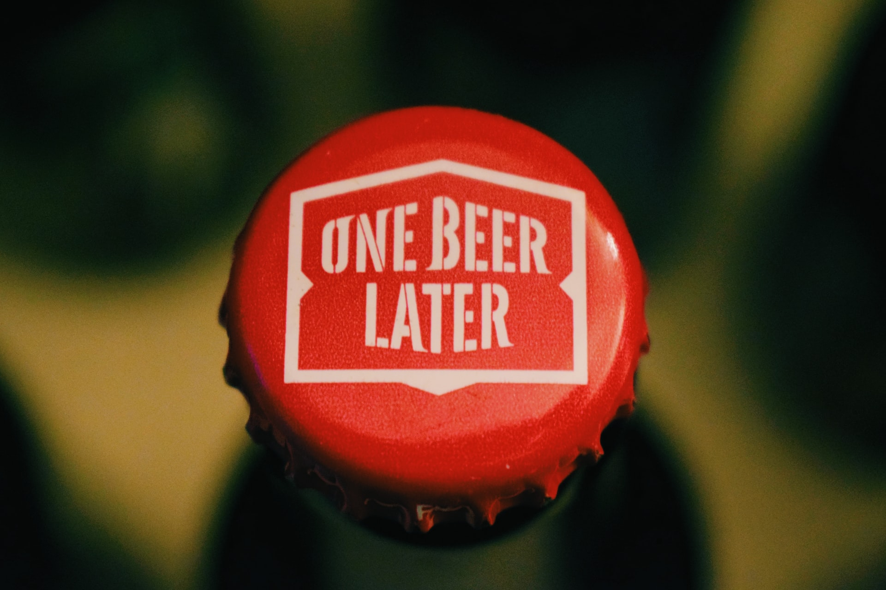

<h1>Scaffold for FIP</h1>
The scaffold of the online craft beer brand, two brand mashups (undetermined), designed with html and css3 in mind. 
This is in-developement and only the preview of the general layout is shown here. 

-----------------------------------------------------------
<h2>Usage</h2>
Open the folder from Sublime Text 3, right click on the codes, and open in browser.

<h2>Built with:</h2>
<ul>
<li>Basic css and html: flexbox layout</li>
<li>Included image from unsplash (stock images)</li>
<li>[Sublime Text 3](https://www.sublimetext.com/3)</li>
</ul>
